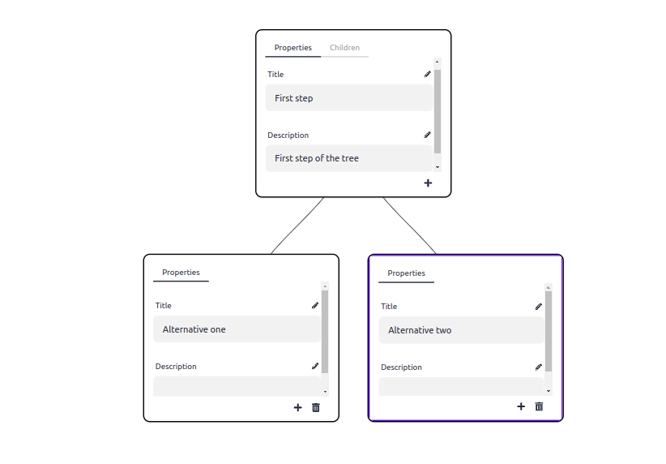
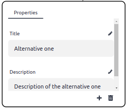
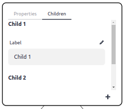

# Decision tree maker

## Description

The `decision-tree-maker` library allows you to use a React component to let your users create decision tree with a visual tool.

A decision tree let you rganize a sequence of steps (sequence of screen for example).



### Is based on

This library is based on [react-d3-tree](https://github.com/bkrem/react-d3-tree).

## Usage

### Quickstart

The usage is very simple :

- `DecisionTreeMaker` : React component to customize decision tree
- `DecisionTree` : TS Type of the tree

```javascript
import { DecisionTreeMaker, DecisionTree } from 'decision-tree-maker';

function App() {
  return (
    <div style={{ border: '1px solid', width: '90vw', height: '90vh' }}>
      <DecisionTreeMaker onChange={(tree) => console.log('onChange', tree)} />
    </div>
  );
}

export default App;
```

The state of the tree is keeped by the library. You juste need to listen the `onChange` prop to have updated tree.

## Final users usage

On each node of the tree, we have some properties. For now we have :

- Title
- Description

You can add or delete new nodes using the corresponding buttons at the bottom of the node :



For the node with children. You can specify the text that corresponds to each child in the "Children" tab :



To edit each field, you need to click on the "pencil" icon button, edit field and click on the "check" icon button.

### Props

List of the props of the component `DecisionTreeMaker`

|       Prop        |                                 Description                                 |
| :---------------: | :-------------------------------------------------------------------------: |
|     onChange      |       Listen the update of the tree (`(tree: DecisionTree) => void`).       |
|      height       |       Height of the decision tree maker component (string or number)        |
|       width       |        Width of the decision tree maker component (string or number)        |
| selectedNodeStyle | Style that will be applied to the `style` prop of the current selected node |

## RoadMap

### Features

- [ ] Let user add image or video on node
- [ ] Let user to add image or video on choice on a node
- [ ] Add tooltip on the buttons
- [ ] Create a hook for the client side to use the generated tree (with "next" / "before" / "currentNode" props)

### Chore

- [ ] Integrate i18n library to translate some labels
- [ ] Ensure the compatibility of package on previous versions of React
- [ ] Check (and fix) high vulnerability

### Documentation

- [ ] Add documentation of the usage of the library
- [ ] Add a very basic example in JS
- [ ] Add a documentation to contribute to this project
- [ ] Improve TS example to be smallest
- [ ] Add a TS example with customization on the selected node

### Ideas

- [ ] Let user override Tree Node Element to have a better render
- [ ] Be framework / library agnostic (Not only React. Maybe add VueJS and Angular support in first time)
